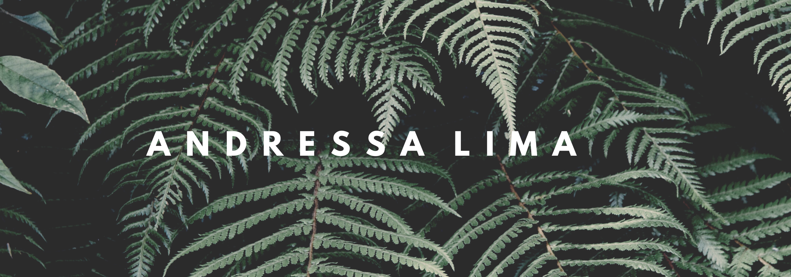

## Olá! Seja Bem Vindo.

### Sobre mim:
Sou mestre em Geodinâmica e  Geofísica pela UFRN. Sempre demonstrei paixão pelas ciências e tecnologias e sempre expressei isso por meio da minha curiosidade e desejo de aprender. Após anos atuano na pesquisa ciéntifica nas áreas de Geologia e Geofísica Marinha, resolvi, em 2020 migrar para as tecnologias. Atualmente tenho me dedicado a aprender programação com Python e tecnologias para desenvolvimento FrontEnd (HTML, CSS e Javascript).

- :book: Estou aprendendo AI com Python e Tecnologias para front-end.
- :hearts: Possuo conhecimendo básico em HTML | CSS | Javascript | Python.
- 👯 Posso ajudar com programas básicos em Python.
- ⚡ Fun fact: Amo actions figures e livros de ficção.
##

### Principais Linguagens:

  
  
  
  

### Histórico de Contribuições: 

  <a href="https://github.com/AndressaLF">
  
  

 ##
 

 
  
  
  
 

